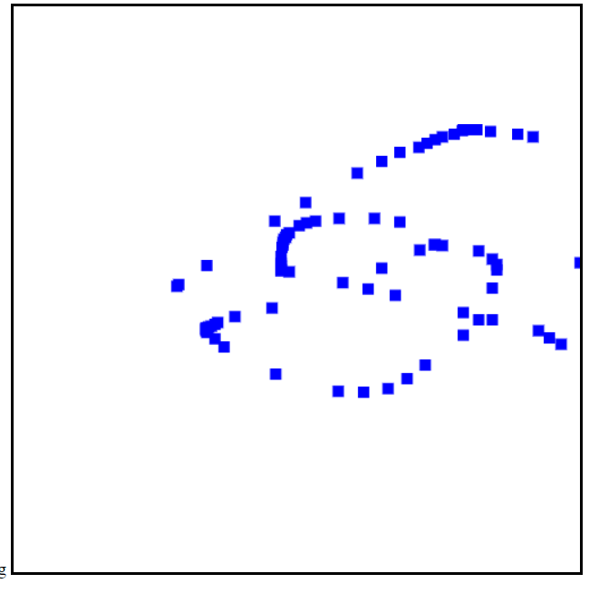

# Javascript---check-pointer-type
using javascript to check the pointer type user use either mouse, finger or pen.

Javascript function on how to differentiate the pointer use by the user 
if its mouse pointer, finger or by using pen on the web application.

This is useful to see in touchscreen application that require to differentiate
the pointer type user use on the application

